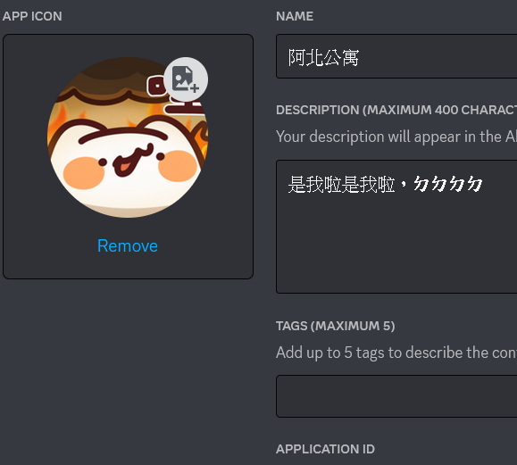
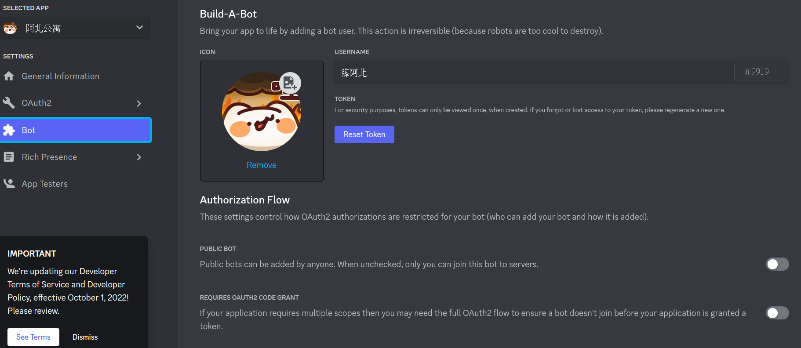
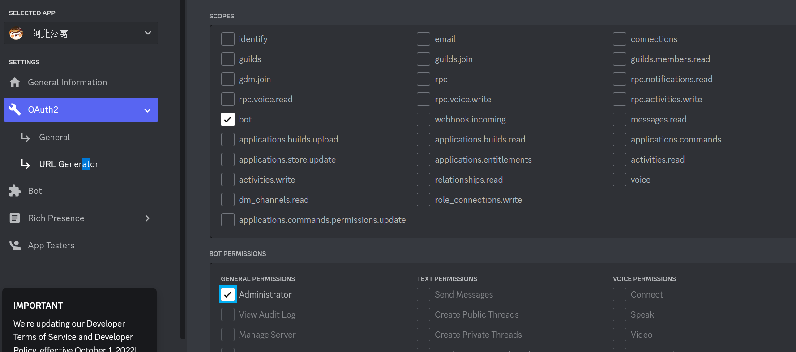

<p align="center">
  
</p>

## Virtualenv
- Python 3.8.6
- Windows10
- Ubuntu 18.04

## How to use  

### Install
```
python -m pip install discord.py
```  
  
### Setting Bot  
1. Get Into Protal  
[Discord Develop Protal](https://discord.com/developers/applications)

2. Profile Setting  
  

3. Authorize Setting  
  
    - Public Bot 是否公開機器人
    - Requires OAuth2 Code Grant 是否需帶入OAuth2認證
    - Presence Intent 接收即時更新資訊
    - Server Members Intent 接收事件或指令
    - Message Content Intent 接收訊息  

4. Select Permission  
  
    1. Choose bot and select permission
    2. Then create the URL to use your bot
